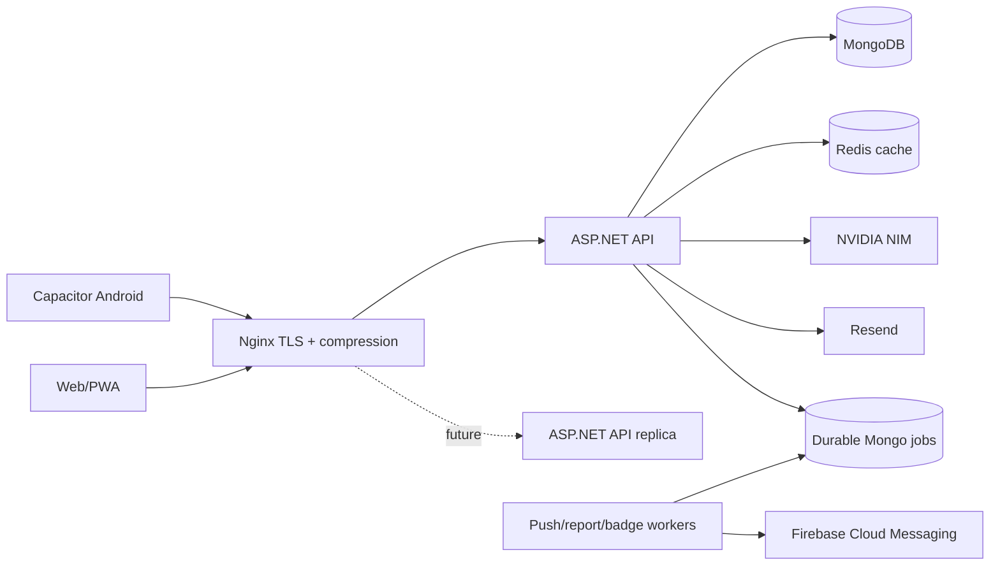

# EduGuard V3 architecture hardening

## Current and target shape

Today the API and in-process workers run in one ASP.NET deployment. Nginx is the stable public entry point and its upstream is ready for more API replicas. Redis is already shared when `REDIS_URL` is configured. Push jobs and device tokens are durable Mongo collections, so an API restart does not lose them.

## V3 boundaries

- `ILibraryService` is the LMS seam. `MongoLibraryService` is the current adapter; a future LMS adapter must preserve `GetIssuedBooksAsync`, `IssueBookAsync`, and `ReturnBookAsync`. The student profile only calls the read endpoint.
- The two-active-book limit is enforced atomically in the Mongo update, not trusted to the UI. Status returned to the UI is derived from the due date.
- `IPushNotificationSender` isolates FCM. `IPushNotificationQueue` provides durable, retrying, non-blocking dispatch. `IPushAudienceNotifier` owns audience expansion.
- Push idempotency is enforced by a unique `idempotencyKey` index. A worker atomically claims one pending job. Report jobs still use job IDs, while badge awards use normalized contribution source keys; both are logically idempotent, but their schedulers should move to the same durable job collection before multiple worker replicas are enabled.
- `ICacheService` isolates Redis/in-memory distributed cache. `INvidiaNimService` isolates NIM and has a shared three-failure/30-second circuit breaker.

## SOLID review

| Principle | Current result | V3 action / remaining work |
|---|---|---|
| Single responsibility | `StudentController` owns profile, import, risk, assignment, report, and PDF behavior; `AttendanceController` mixes authorization, rules, persistence, and recalculation. | New library and push logic lives in services/controllers. Split existing student/report/assignment and attendance authorization/application services in later focused changes; doing it inside V3 would risk V1 behavior. |
| Open/closed | `RiskEngine` and badge classification are static conditional blocks. | No speculative strategy hierarchy was added. Extract `IRiskRule` and `IBadgeRule` only when the next independently deployed rule arrives; current source-key badge dedupe remains intact. |
| Liskov substitution | Existing providers previously had no interfaces. | Library, push, cache, and NIM implementations have behavior-specific interfaces and no stronger preconditions than their contracts. |
| Interface segregation | Mongo exposes every collection and controllers consume the concrete context. | New interfaces are narrow. A future repository migration should introduce use-case repositories (`IStudentRepository`, `IJobRepository`) rather than one large generic repository/interface. |
| Dependency inversion | Controllers depended on concrete cache/NIM implementations. | Cache and NIM now resolve through interfaces; new library and push business flows do too. Existing controllers still depend on `MongoService`, recorded below as debt. |

## Horizontal-scaling blockers

1. `BadgeAwardWorker` has an in-memory channel and dedupe dictionary. Run one badge worker replica until its scheduler is moved to durable jobs.
2. SignalR uses in-process connections. Multiple API replicas require a Redis/Azure SignalR backplane and sticky connections during migration.
3. Data Protection keys are written to local `obj/`; replicas need a shared key ring (Redis/blob/volume), otherwise auth-protected payloads can fail across instances.
4. Generated report files use local disk as a fallback. Database HTML is portable, but production artifacts should use object storage before relying on multiple workers.
5. Global ASP.NET rate limits are per process. Move abuse-sensitive limits to Nginx/Redis when adding replicas.
6. Most controllers directly use `MongoService`; this blocks isolated unit tests and provider swaps, though it does not itself prevent replicas.

## Operations

- Build Nginx with the dynamic Brotli module referenced by `load_module`; remove the Brotli directives only if the chosen image cannot provide it.
- Mount certificates at `/etc/nginx/certs`, replace `api.eduguard.example`, and point `api:5000` at the backend service.
- FCM HTTP v1 needs `FCM_PROJECT_ID` and a valid OAuth access token in `FCM_ACCESS_TOKEN`. Production should refresh that token through workload identity/secret automation; never commit it.
- Android also needs the Firebase-generated `google-services.json` in `frontend/android/app/` before building.
- Web/PWA notification delivery remains separate. Mobile and web should share user preference fields (category opt-in, quiet hours, important-alert override), while device tokens/subscriptions remain provider-specific records. No current PWA notification flow was found, so this patch does not change web behavior.
