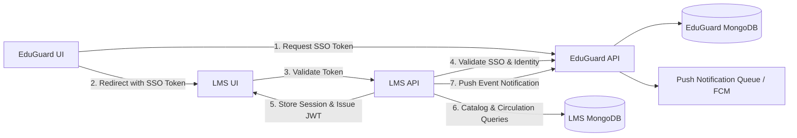
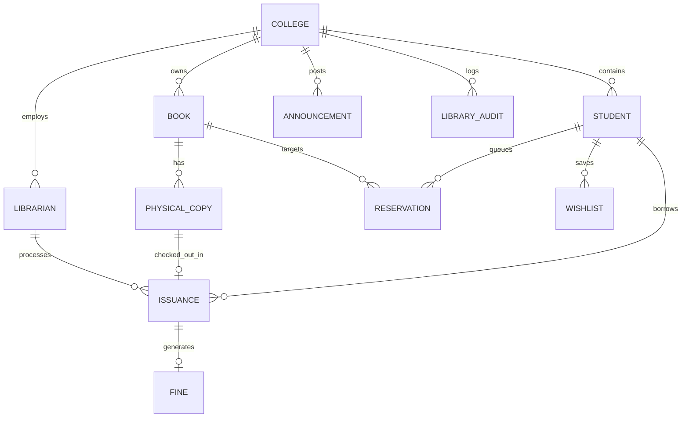

# EduGuard LMS Complete System Documentation, Entity Relationships & Integration Guide

## Table of Contents
1. [Project Overview](#project-overview)
2. [EduGuard vs. LMS System Responsibilities](#eduguard-vs-lms-system-responsibilities)
3. [System Architecture & Data Flows](#system-architecture--data-flows)
4. [Entity-Relationship (ER) Model](#entity-relationship-er-model)
5. [Authentication, SSO & Security](#authentication-sso--security)
6. [Core Workflows](#core-workflows)
   - [Book Search & Catalog Management](#1-book-search--catalog-management)
   - [Physical Book Copies & Accession Barcode System](#2-physical-book-copies--accession-barcode-system)
   - [Issue & Loan Processing](#3-issue--loan-processing)
   - [Return, Fine Calculation & Settlement](#4-return-fine-calculation--settlement)
   - [Reservation Queue Management](#5-reservation-queue-management)
7. [Service-to-Service Integration (`LMS_SERVICE_KEY`)](#service-to-service-integration-lms_service_key)
8. [Demo College Showcase & Sample Data Seeder](#demo-college-showcase--sample-data-seeder)
9. [Environment Variables Reference](#environment-variables-reference)
10. [Automated Testing & Build Verification](#automated-testing--build-verification)

---

## Project Overview

The **EduGuard Library Management System (LMS)** is a complete, production-grade college library system operating in tandem with **EduGuard College Operating System**.

- **EduGuard API**: `https://edugard-aipowerd.onrender.com`
- **EduGuard UI**: `https://edugard-ai-powerd.vercel.app`
- **LMS API**: `https://edugard-aipowerd-1.onrender.com`
- **LMS UI**: `https://edugard-ai-powerd-swsb.vercel.app`

---

## EduGuard vs. LMS System Responsibilities

To maintain strict domain isolation while supporting unified college operations:

| Feature / Domain | EduGuard Ownership | LMS Ownership |
| :--- | :--- | :--- |
| **User Identity & Credentials** | Yes (Students, Mentors, Admins, Passwords) | No (References EduGuard `studentId` & `actorId`) |
| **College & Degree Scope** | Yes (Colleges, Courses, Classes, Semesters) | No (Validates against EduGuard API) |
| **SSO & Token Dispatch** | Yes (Issues 5-minute SSO Handoff Tokens) | Validates SSO Token and issues 8-hour LMS JWT |
| **Push Notifications** | Device token queue & FCM dispatch | Triggers push events via `X-EduGuard-Service-Key` |
| **Book Catalog & Physical Copies** | No | Full ownership (`isbn`, `accessionNumber`, `barcode`) |
| **Circulation (Issue/Return/Renew)** | Reads summary for EduGuard Books tab | Full processing, active slots & idempotency keys |
| **Fines, Waivers & Payments** | Reads total fine summary | Full fine ledger, payments, waivers, and receipts |
| **Reservations Queue** | No | Full reservation priority queue management |
| **Library Audit Logs** | No | Full audit trail (`action`, `actorId`, `entityId`) |

---

## System Architecture & Data Flows



---

## Entity-Relationship (ER) Model



---

## Authentication, SSO & Security

1. **SSO Handoff**:
   - User clicks **Open Library** in EduGuard dashboard.
   - EduGuard backend generates short-lived SSO token (`/api/integrations/lms/sso/issue`).
   - Browser opens LMS frontend with hash `#token=SSO_TOKEN`.
   - LMS frontend exchanges token via `POST /api/auth/exchange`.
   - LMS backend validates token against EduGuard API (`POST /api/integrations/lms/sso/validate`).
   - LMS backend issues 8-hour JWT signed with `LMS_JWT_SECRET`.
   - LMS frontend removes token hash from browser URL bar to prevent replay attacks.

2. **Librarian Direct Login**:
   - Librarians can also sign in directly at the LMS login screen using credentials created by their College Administrator.

---

## Core Workflows

### 1. Book Search & Catalog Management
- **Debounced Search**: 350ms input debouncing prevents UI flickering and maintains input focus.
- **Filters**: Multi-field search across Title, Author, ISBN, Category, Department, Language, Publisher, and Availability.
- **Caching**: 10-minute Redis cache keyed by catalog version tag (`lms:catalog:{collegeId}:{version}:...`). Cache automatically invalidates on catalog modifications.

### 2. Physical Book Copies & Accession Barcode System
- Each physical copy receives a unique accession number (`9780262046305-001`) and barcode string (`BC-9780262046305-001`).
- Copy Statuses: `available`, `issued`, `reserved`, `lost`, `damaged`, `missing`, `repair`, `withdrawn`.
- Instant Barcode Scan: Librarians scan or type accession barcodes at the circulation desk for quick issue and return.

### 3. Issue & Loan Processing
- **Active Loan Limit**: Enforces default (2 books) or degree-specific limits (e.g. BCA: 3, M.Tech: 5).
- **Idempotency Protection**: Every issue action requires an `Idempotency-Key` header (`collegeId:key`). Retrying identical requests returns previous result without duplicating slot allocations.
- **Holiday-Aware Due Date**: Calculates due dates by skipping Sundays and configured college holiday dates (`Holidays` list).

### 4. Return, Fine Calculation & Settlement
- Scans accession barcode or selects active issuance.
- Calculates daily overdue fines (`DailyFineRate` = ₹5/day).
- Supports partial fine payments, full payments, and fine waivers with reason logging.

### 5. Reservation Queue Management
- Queues student reservations when all physical copies are checked out.
- Prevents duplicate active reservations for the same book by the same student.
- Upon book return, automatically promotes queue position #1 to `ready` status.

---

## Service-to-Service Integration (`LMS_SERVICE_KEY`)

Server-to-server communication between EduGuard API and LMS API uses `X-EduGuard-Service-Key` or `X-LMS-Service-Key` headers:

- **EduGuard Books Tab Sync**: `GET /api/internal/eduguard/students/{studentId}/issued` returns real-time active issuances and due dates for EduGuard mobile and web apps.
- **Push Notification Dispatch**: `POST /api/integrations/lms/push` dispatches instant push alerts for overdue books and reservation ready statuses.

---

## Test data

The deployed application intentionally exposes no HTTP seed endpoint. Test data must be rebuilt only in a confirmed development or staging environment through the authenticated application APIs, after taking a database backup.

---

## Environment Variables Reference

### LMS Backend (`lms/backend/`)
```env
LMS_MONGO_URI=mongodb://127.0.0.1:27017/eduguard_lms
LMS_JWT_SECRET=production_super_secret_jwt_key_at_least_32_bytes_long!
LMS_SERVICE_KEY=eduguard_lms_shared_service_key_2026
EDUGUARD_API_URL=https://edugard-aipowerd.onrender.com
LMS_FRONTEND_URL=https://edugard-ai-powerd-swsb.vercel.app
```

### LMS Frontend (`lms/frontend/`)
```env
VITE_LMS_API_URL=https://edugard-aipowerd-1.onrender.com
VITE_EDUGUARD_URL=https://edugard-ai-powerd.vercel.app
```

---

## Automated Testing & Build Verification

### Unit & Business Logic Tests
Run backend C# unit tests:
```powershell
dotnet build lms/backend/Lms.Api.csproj
```
Tests in `Lms.Api.Tests.LmsUnitTests` verify:
1. `TestDueDateCalculationSkipsSundaysAndHolidays`: Verifies holiday and Sunday skipping.
2. `TestPhysicalCopyAccessionNumberFormat`: Verifies barcode series generation.
3. `TestBookAvailabilityCalculation`: Verifies total vs available copies count.
4. `TestFineCalculation`: Verifies overdue fine calculations.

### Build Verification Results
- `dotnet build lms/backend/Lms.Api.csproj` -> **Code 0 (Success, 0 Errors)**
- `npm run build --prefix lms/frontend` -> **Code 0 (Success, 0 Errors)**
- `dotnet build backend/backend.csproj` -> **Code 0 (Success, 0 Errors)**
- `npm run build --prefix frontend` -> **Code 0 (Success, 0 Errors)**
